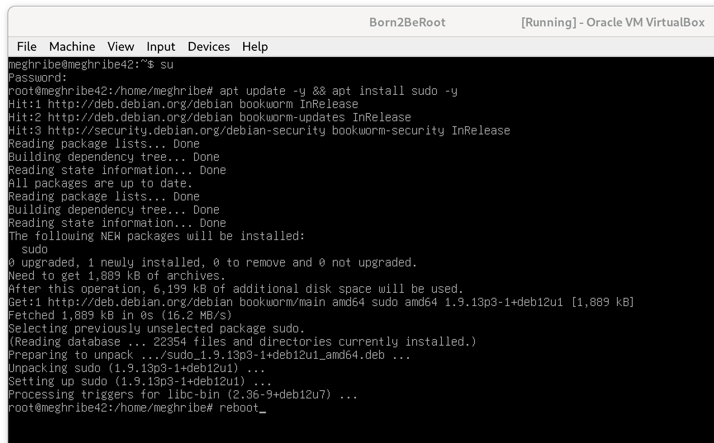
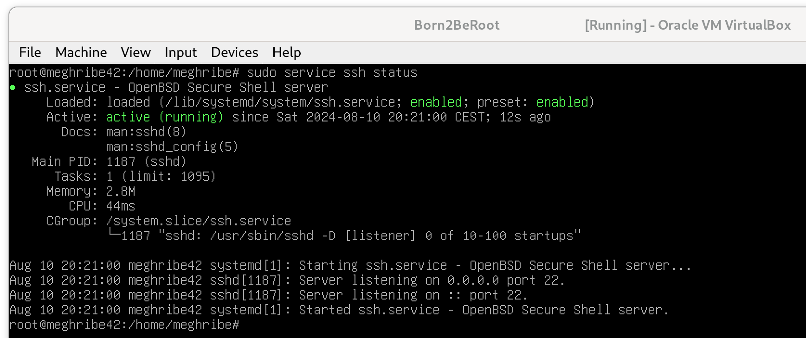
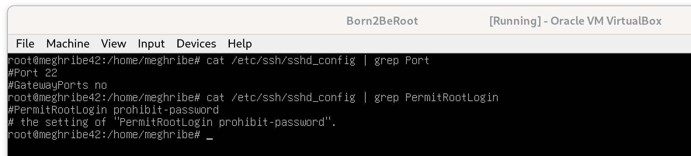
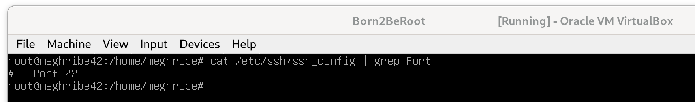
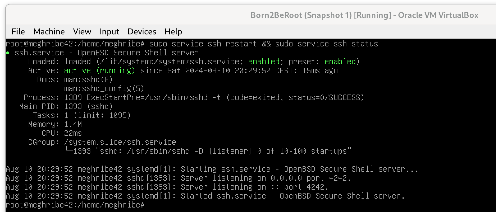
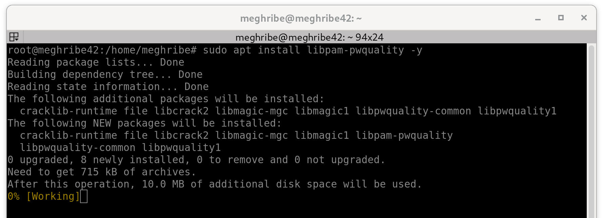
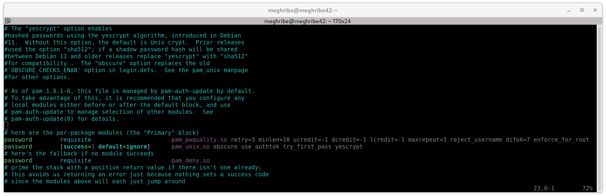

# Born2BeRoot Debian Tutorial

1. Descargar la maquina virtual

- Crear la maquina virtual en VirtualBox























### Script
```bash
#!/bin/bash

# Architecture
arch=$(uname -a)

# CPU Info
cpuf=$(lscpu | awk '/Socket\(s\):/ {print $2}')
cpuv=$(lscpu | awk '/^CPU\(s\):/ {print $2}')

# RAM Info
ram_total=$(free -m | awk '/Mem:/ {print $2}')
ram_use=$(free -m | awk '/Mem:/ {print $3}')
ram_percent=$(free -m | awk '/Mem:/ {printf("%.2f"), $3/$2*100}')

# Disk Info
disk_total=$(df -h --total | awk '/^total/ {print $2}')
disk_use=$(df -h --total | awk '/^total/ {print $3}')
disk_percent=$(df -h --total | awk '/^total/ {print $5}')

# CPU Load
cpu1=$(vmstat 1 2 | tail -1 | awk '{printf $15}')
cpu_op=$(expr 100 - $cpu1)
cpu_fin=$(printf "%.1f" $cpu_op)

# Last Boot
last_boot=$(who -b | awk '{print $3, $4}')

# LVM Usage
lvmu=$(lsblk | grep -q "lvm" && echo "yes" || echo "no")

# TCP Connections
tcp_conn=$(ss -tan | grep -c ESTAB)

# Logged Users
user_log=$(who | wc -l)

# Network Info
ip=$(hostname -I)
mac=$(ip link show | awk '/link\/ether/ {print $2}')

# Sudo Commands
sudo_cmd=$(journalctl _COMM=sudo | grep COMMAND | wc -l)

wall "	Architecture: $arch
	CPU physical: $cpuf
	vCPU: $cpuv
	Memory Usage: $ram_use/${ram_total}MB ($ram_percent%)
	Disk Usage: $disk_use/$disk_total ($disk_percent)
	CPU load: $cpu_fin%
	Last boot: $last_boot
	LVM use: $lvmu
	Connections TCP: $tcp_conn ESTABLISHED
	User log: $user_log
	Network: IP $ip ($mac)
	Sudo: $sudo_cmd cmd"
```
