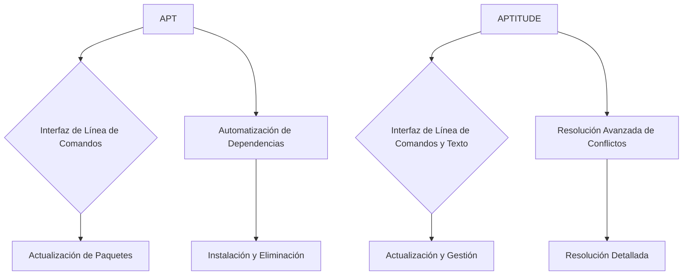
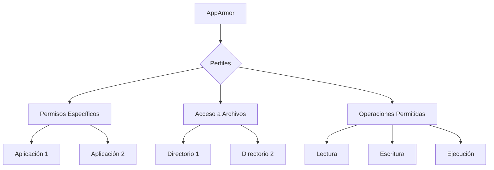
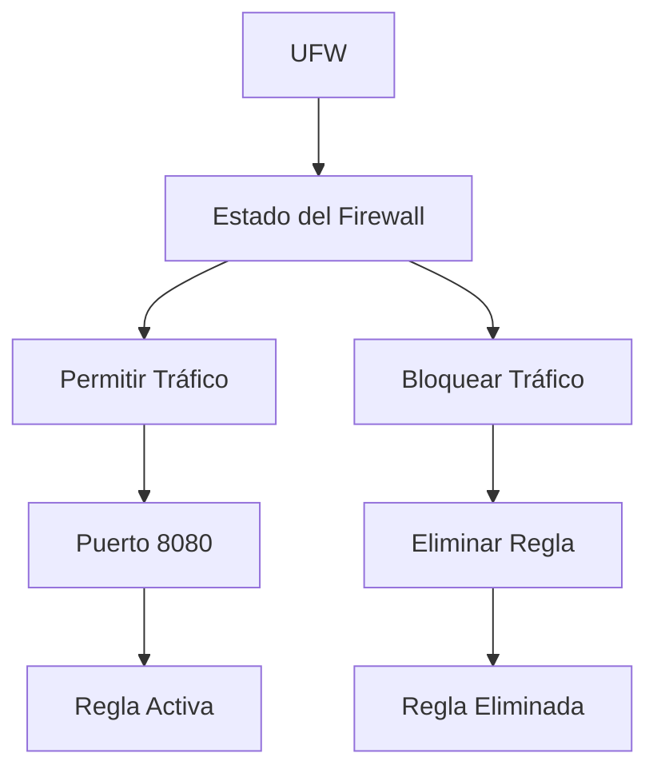
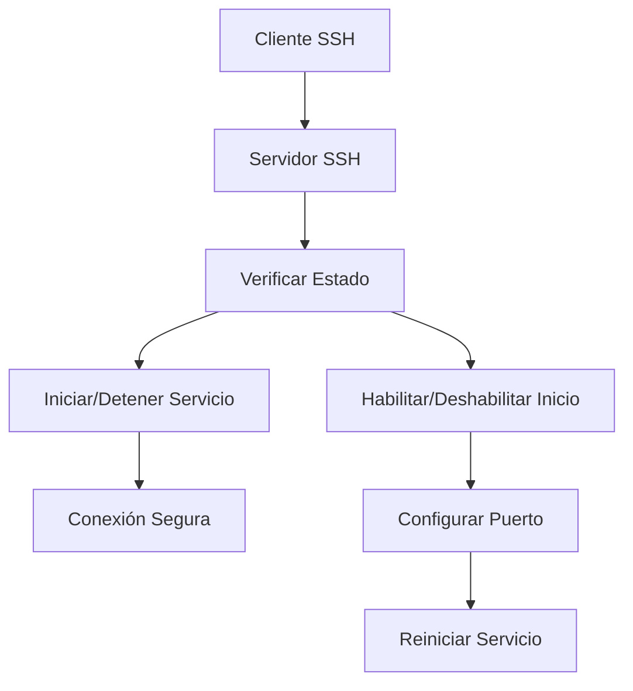
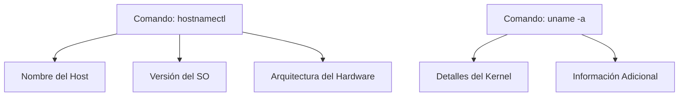
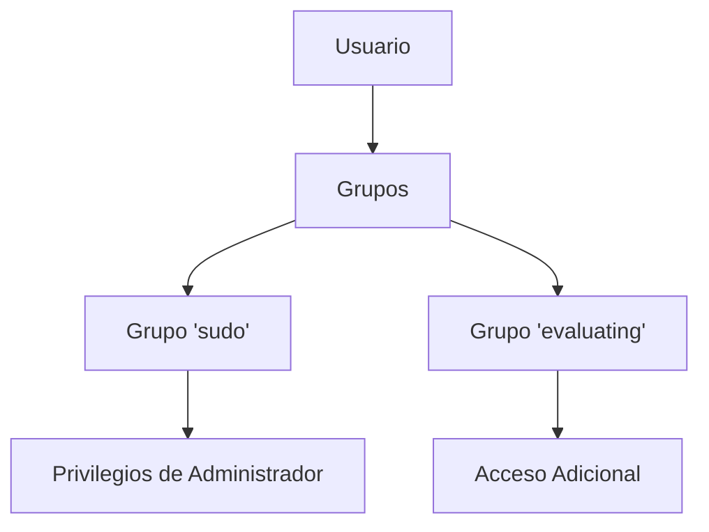
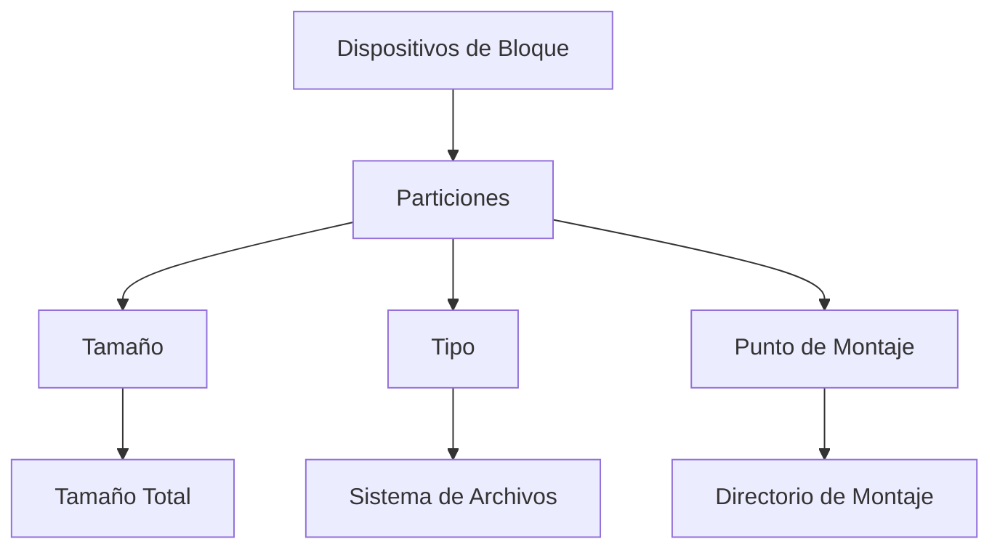
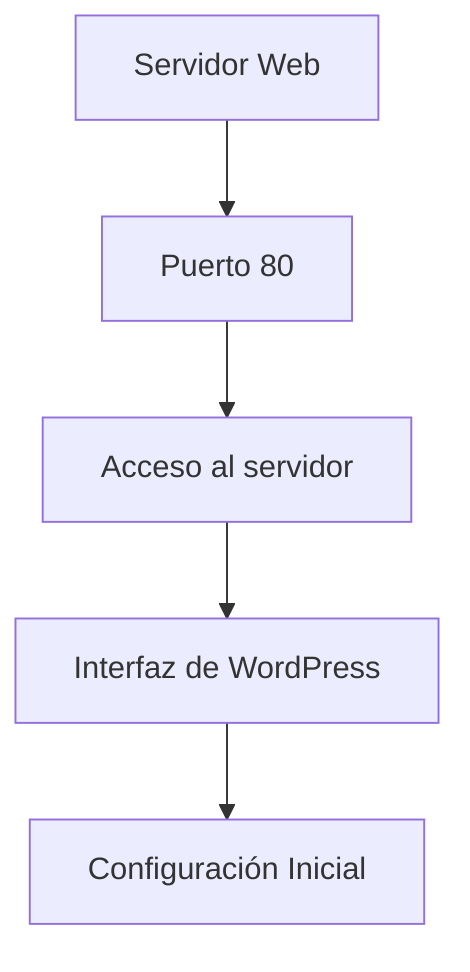
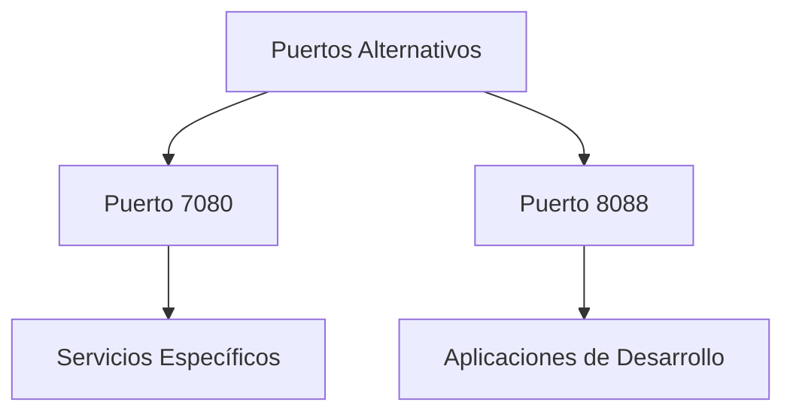

### **1. APT vs. APTITUDE** 🛠️

#### **APT (Advanced Package Tool)**

- **Descripción General**: APT es una herramienta de gestión de paquetes para distribuciones basadas en Debian como Ubuntu. Facilita la instalación, actualización y eliminación de paquetes de software con comandos sencillos. 🎯

- **Comandos Básicos**:
  - **Actualizar la Lista de Paquetes**:
    ```bash
    sudo apt update
    ```
    Este comando actualiza la lista de paquetes disponibles desde los repositorios. No instala ni actualiza paquetes, solo refresca la base de datos. 🆙

  - **Actualizar Paquetes Instalados**:
    ```bash
    sudo apt upgrade
    ```
    Actualiza todos los paquetes instalados a la versión más reciente según la lista actualizada. 🛠️

  - **Instalar un Paquete**:
    ```bash
    sudo apt install nombre_paquete
    ```
    Descarga e instala el paquete especificado, resolviendo automáticamente las dependencias necesarias. 🚀

  - **Eliminar un Paquete**:
    ```bash
    sudo apt remove nombre_paquete
    ```
    Elimina el paquete especificado pero conserva los archivos de configuración. Usa `sudo apt purge nombre_paquete` para una eliminación completa. 🗑️

- **Beneficios**:
  - **Simplicidad**: Fácil de usar para tareas comunes de gestión de paquetes. 👌
  - **Automatización**: Maneja dependencias automáticamente, simplificando las actualizaciones. 🤖

#### **APTITUDE**

- **Descripción General**: APTITUDE es una herramienta avanzada para la gestión de paquetes que ofrece una interfaz de línea de comandos y una interfaz gráfica en texto. Maneja de manera más eficiente las dependencias complejas y las resoluciones de conflictos. 📊

- **Comandos Básicos**:
  - **Actualizar la Lista de Paquetes**:
    ```bash
    sudo aptitude update
    ```
    Similar a `apt update`, pero con una interfaz interactiva que muestra el progreso. 📈

  - **Actualizar Paquetes Instalados**:
    ```bash
    sudo aptitude upgrade
    ```

  - **Instalar un Paquete**:
    ```bash
    sudo aptitude install nombre_paquete
    ```

  - **Eliminar un Paquete**:
    ```bash
    sudo aptitude remove nombre_paquete
    ```

- **Ventajas**:
  - **Interfaz Interactiva**: Ofrece una vista más clara de las dependencias y posibles conflictos. 🔍
  - **Manejo de Dependencias**: Resuelve conflictos de forma más detallada, ideal para entornos complejos. 🔧

- **Diagrama de Comparación**:



---

### **2. Qué es AppArmor** 🛡️

- **Descripción General**: AppArmor es un módulo de seguridad del núcleo Linux que usa perfiles para controlar el acceso de las aplicaciones a archivos y recursos del sistema. Protege contra el acceso no autorizado restringiendo lo que cada aplicación puede hacer. 🔒

- **Perfiles**:
  - **Definición**: Cada perfil define permisos específicos para una aplicación, controlando su acceso a archivos y directorios. 📂
  - **Modos de Operación**:
    - **Enforce (Aplicar)**: Las reglas del perfil se aplican estrictamente y bloquean cualquier acceso no autorizado. 🚫
    - **Complain (Informar)**: Las violaciones se registran, pero no se bloquean. Ideal para pruebas y ajustes. 📝

- **Cómo Funciona**:
  - **Identificación de Rutas**: AppArmor utiliza rutas absolutas para definir permisos, facilitando la configuración de perfiles. 🛠️
  - **Seguridad**: Restringe permisos para minimizar el impacto si una aplicación es comprometida. Crucial para servicios expuestos a internet. 🌐

- **Beneficios**:
  - **Flexibilidad**: Configuración precisa de permisos, equilibrando seguridad y funcionalidad. ⚖️
  - **Integración**: Integrado en muchas distribuciones Linux y habilitado por defecto para algunas aplicaciones. 🔧

- **Diagrama de Perfiles**:



---

### **3. Verificación de UFW (Uncomplicated Firewall)** 🔥

- **Descripción General**: UFW es una herramienta de firewall sencilla para gestionar las reglas del firewall en sistemas Linux. Su objetivo es simplificar la configuración del firewall para usuarios no expertos en redes. 🌐

- **Comandos Básicos**:
  - **Instalación**:
    ```bash
    sudo apt install ufw
    ```
    Instala UFW en el sistema. Algunas distribuciones lo tienen preinstalado. 📦

  - **Verificar Estado**:
    ```bash
    sudo ufw status
    ```
    Muestra el estado actual del firewall y las reglas activas. 🔍

  - **Agregar Regla para Abrir Puerto 8080**:
    ```bash
    sudo ufw allow 8080
    ```
    Permite el tráfico entrante en el puerto 8080, útil para servicios web. 🌐

  - **Eliminar Regla para Puerto 8080**:
    ```bash
    sudo ufw delete allow 8080
    ```
    Elimina la regla para bloquear de nuevo el acceso en el puerto 8080. 🛡️

- **Beneficios**:
  - **Simplicidad**: Fácil de usar, ideal para usuarios menos experimentados. 🧩
  - **Facilidad de Configuración**: Aplica reglas rápidamente para gestionar el acceso a servicios y proteger el sistema. 🔧

- **Diagrama de Configuración**:



---

### **4. Uso de `systemctl`** ⚙️

- **Descripción General**: `systemctl` es una herramienta de línea de comandos para gestionar servicios y unidades del sistema en distribuciones Linux que usan `systemd`. Permite iniciar, detener, habilitar y verificar servicios. 🔄

- **Comandos Básicos**:
  - **Iniciar un Servicio**:
    ```bash
    sudo systemctl start nombre_servicio
    ```
    Inicia el servicio especificado. 🚀

  - **Detener un Servicio**:
    ```bash
    sudo systemctl stop nombre_servicio
    ```
    Detiene el servicio especificado. 🛑

  - **Reiniciar un Servicio**:
    ```bash
    sudo systemctl restart nombre_servicio
    ```
    Reinicia el servicio especificado, aplicando cambios de configuración. 🔄

  - **Habilitar un Servicio para que Inicie al Arrancar**:
    ```bash
    sudo systemctl enable nombre_servicio
    ```
    Configura el servicio para que se inicie automáticamente al arrancar el sistema. 🔧

  - **Deshabilitar un Servicio**:
    ```bash
    sudo systemctl disable nombre_servicio
    ```
    Evita que el servicio se inicie automáticamente al arrancar el sistema. 🚫

  - **Verificar el Estado de un Servicio**:
    ```bash
    sudo systemctl status nombre_servicio
    ```
    Muestra el estado actual del servicio, incluyendo si está activo, inactivo o ha fallado. 🔍

- **Beneficios**:
  - **Control Centralizado**: Permite gestionar todos los servicios y unidades desde una única herramienta. 🌟
  - **Eficiencia**: Proporciona una forma eficiente de controlar el estado del sistema y de los servicios. ⚙️

---

### **5. Verificación de SSH (Secure Shell)** 🔐

- **Descripción General**: SSH es un protocolo de red que proporciona una conexión segura y cifrada entre dos sistemas a través de una red insegura. Se utiliza para administrar sistemas y transferir datos de forma segura. 🌐

- **Comandos Básicos**:
  - **Verificar Cliente SSH**:
    ```bash
    ssh -V
    ```
    Muestra la versión del cliente SSH instalado en el sistema. 🆙

  - **Verificar Servidor SSH (sshd)**:
    ```bash
    sshd -v
    ```
    Muestra la versión del servidor SSH. Alternativamente:
    ```bash
    sudo systemctl status ssh
    ```
    Muestra el estado del servicio SSH. 🔍

  - **Instalar SSH**:
    ```bash
    sudo apt-get update
    sudo apt-get install openssh-server
    ```
    Instala el servidor SSH para aceptar conexiones entrantes. 📦

  - **Verificar Estado del Servicio SSH**:
    ```bash
    sudo systemctl status ssh
    ```
    Verifica si el servicio SSH está en ejecución. 🔍

  - **Iniciar Servicio SSH**:
    ```bash
    sudo systemctl start ssh
    ```
    Inicia el servicio SSH si no está en ejecución. 🚀

  - **Habilitar SSH al Inicio**:
    ```bash
    sudo systemctl enable ssh
    ```
    Configura el servicio SSH para que se inicie automáticamente al arrancar el sistema. 🔧

  - **Cambiar el Puerto de SSH a 4242**:
    - Editar el archivo de configuración de SSH:
      ```bash
      sudo nano /etc/ssh/sshd_config
      ```
      Cambiar la línea:
      ```bash
      Port 4242
      ```
    - Reiniciar el servicio SSH para aplicar los cambios:
      ```bash
      sudo systemctl restart ssh
      ```

- **Beneficios**:
  - **Seguridad**: Proporciona una conexión segura y cifrada para administración remota y transferencia de datos. 🔒
  - **Flexibilidad**: Permite conexiones a servidores desde ubicaciones remotas. 🌍

- **Diagrama de Flujo SSH**:



---

### **6. Verificación del Sistema Operativo** 🖥️

- **Mostrar Información del Sistema**:
  ```bash
  hostnamectl
  ```
  Muestra información detallada sobre el sistema operativo, como el nombre del host, la versión del sistema operativo y la arquitectura del hardware. 🔍

- **Uso Adicional**:
  Para obtener detalles adicionales sobre la versión del kernel y otros aspectos del sistema:
  ```bash
  uname -a
  ```

- **Diagrama de Información del Sistema**:



---

### **7. Verificación de Usuario y Grupo** 👤👥

- **Verificar Usuario en Grupos**:
  - **Comando**:
    ```bash
    groups nombre_usuario
    ```
    Muestra los grupos a los que pertenece el usuario especificado. 🗂️

  - **Verificar Membresía en el Grupo "sudo"**:
    ```bash
    getent group sudo
    ```
    Muestra todos los usuarios que son miembros del grupo `sudo`, el cual tiene privilegios de administrador. 🔐

- **Crear Usuario y Grupo**:
  - **Crear Usuario**:
    ```bash
    sudo adduser nuevo_usuario
    ```
    Crea un nuevo usuario con un directorio personal y parámetros básicos. 🆕

  - **Crear Grupo "evaluating"**:
    ```bash
    sudo groupadd evaluating
    ```
    Crea un grupo llamado `evaluating`. 🏷️

- **Añadir Usuario a un Grupo**:
  ```bash
  sudo usermod -aG evaluating nombre_usuario
  ```
  Añade el usuario al grupo `evaluating` sin eliminarlo de otros grupos. 🏷️

- **Diagrama de Gestión de Usuarios y Grupos**:



---

### **8. Verificación de Particiones** 💾

- **Mostrar Particiones Actuales**:
  ```bash
  lsblk
  ```
  Muestra la lista de dispositivos de bloque (particiones y discos) en el sistema, con detalles sobre tamaño, tipo y punto de montaje. 📊

- **Uso Adicional**:
  Para obtener detalles adicionales sobre las particiones, incluyendo el sistema de archivos:
  ```bash
  df -h
  ```

- **Diagrama de Particiones**:



---

### **9. Configuración de WordPress** 🌐

- **Acceso con la IP**:
  - **URL**:
    ```bash
    http://IP:80
    ```
    Accede a la interfaz web de WordPress (o cualquier otro servicio corriendo en el puerto 80) desde el navegador del mismo sistema. 🌐

- **Configuración Básica**:
  Asegúrate de que el servidor web (Apache o Nginx) esté funcionando y que WordPress esté instalado en el directorio web. 🛠️

- **Diagrama de Configuración de WordPress**:



---

### **10. Servidor de Elección (Opcional)** 🌐

- **Acceso a Puertos Alternativos**:
  - **URL para Otros Servicios**:
    - **Puerto 7080**:
      ```bash
      http://IP:7080
      ```
      Utilizado para servicios específicos o aplicaciones web en ese puerto. 🛠️

    - **Puerto 8088**:
      ```bash
      http://IP:8088
      ```
      Otro puerto común para aplicaciones web, a menudo usado para desarrollo o pruebas. 🔧

- **Diagrama de Puertos Alternativos**:


