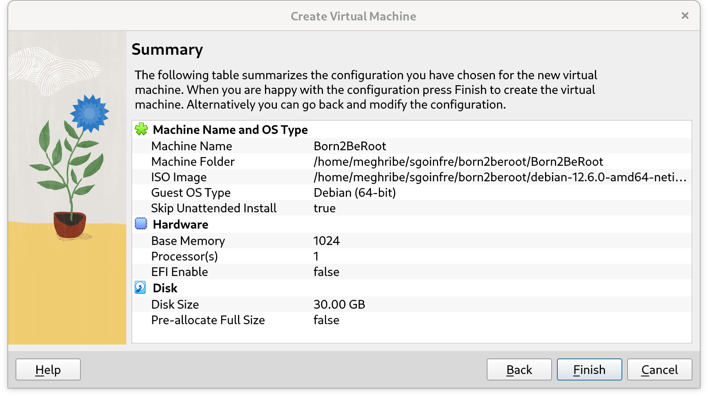

**Descargar la ISO de Debian y Preparar el Entorno**

Primero, necesitamos descargar la ISO oficial de Debian desde su página web. Para mantener organizada nuestra máquina virtual y no llenar el espacio en el directorio `home` (que solo tiene 5GB disponibles), crearemos una carpeta en `~/sgoinfre` llamada `born2beroot`. Aquí se almacenará la ISO y se creará la carpeta de nuestra máquina virtual.

Ejecuta el siguiente comando para crear la carpeta y descargar la ISO:

```shell
cd ~/sgoinfre && mkdir -p born2beroot && cd born2beroot && wget https://cdimage.debian.org/debian-cd/current/amd64/iso-cd/debian-12.6.0-amd64-netinst.iso
```





